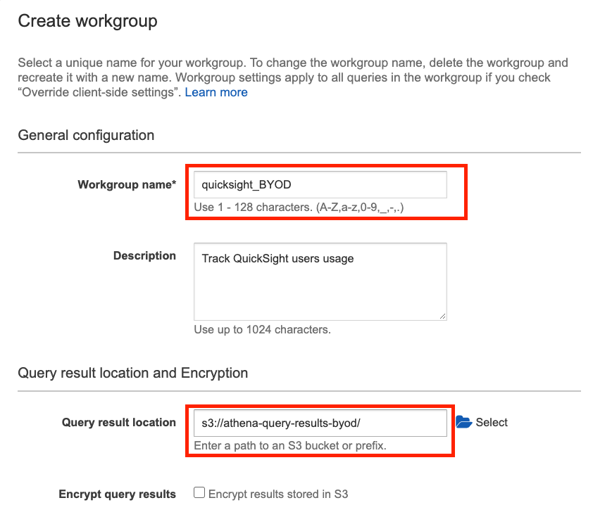
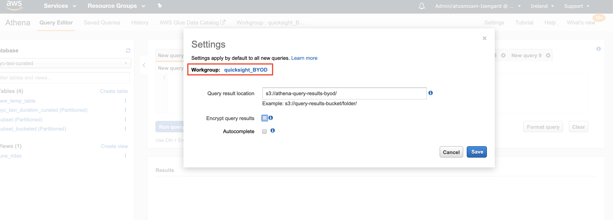
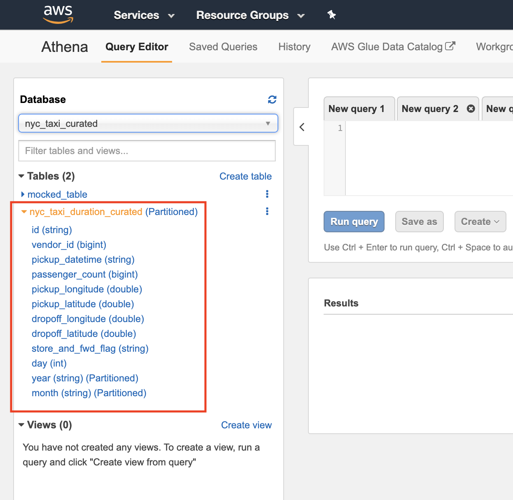
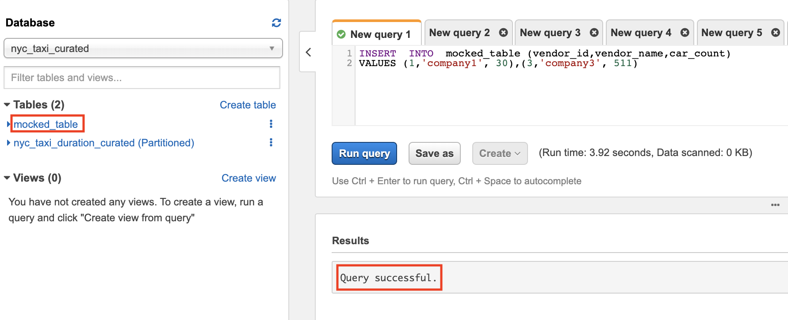
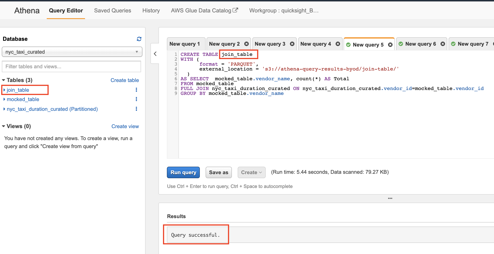

[0-Prerequisites](../00_Prerequisites/README.md) > [1-Ingestion](../01_ingestion_with_glue/README.md) > [2-Orchestration](../02_orchestration/README.md) > 3-Interactive-SQL > [4-Visualisation](../04_visualization_and_reporting/README.md) > [5-Transformations](../05_transformations/README.md)


# Lab 3: Interactive SQL Queries Using Amazon Athena

- [Lab 3: Interactive SQL Queries Using Amazon Athena](#Lab-3-Interactive-SQL-Queries-Using-Amazon-Athena)
  - [Introduction](#Introduction)
  - [Architectural Diagram](#Architectural-Diagram)
  - [Setting up Workgroups](#Setting-up-Workgroups)
  - [Setting up Amazon S3 and Athena for Storing Query Results](#Setting-up-Amazon-S3-and-Athena-for-Storing-Query-Results)
    - [Creating an Amazon S3 Bucket](#Creating-an-Amazon-S3-Bucket)
    - [Setting up Amazon Athena](#Setting-up-Amazon-Athena)
  - [Start Exploring with Athena](#Start-Exploring-with-Athena)
  - [Amazon Athena Best Practices](#Amazon-Athena-Best-Practices)
  - [Joining Tables](#Joining-Tables)
    - [Create a new Table](#Create-a-new-Table)
    - [SQL Joins](#SQL-Joins)
    - [Storing SQL Join Results](#Storing-SQL-Join-Results)
  - ['Create Table as Select' Queries](#Create-Table-as-Select-Queries)
  - [Creating Views](#Creating-Views)

## Introduction

Amazon Athena is an interactive query service that makes it easy to analyze data in Amazon S3 using standard SQL. Athena is serverless, so there is no infrastructure to setup or manage, and you can start analyzing data immediately. You don’t even need to load your data into Athena, it works directly with data stored in S3.

In this lab, we will use Athena to explore, analyze and prepare the data for visualization in QuickSight. This lab is divided into three sections; one mandatory and two optional:

*  To start working with Athena, continue on this lab and follow through the different section. Next lab is [Setting up Workgroups](#setting-up-workgroups)
*  [Optional] In [lab 1](../01_ingestion_with_glue/README.md), we used Glue Crawlers to create our Database and Tables. To create your Database and tables using Athena, click [here](./optional.md)
*  [Optional] To review Athena best practices, click on [Amazon Athena Best Practices](./athena_best_practices.md)


## Architectural Diagram

This is an example architecture, the raw data is stored in S3 in CSV format and the curated data is stored in another S3 bucket in Parquet. While you might have a different setup, this is only for illustrative purposes. Amazon Athena will be used to query both data sources if needed. 


  

## Setting up Workgroups

  

Workgroups are used to isolate queries for teams, applications, or different workloads. Workgroups offer some benefits such as:

  

- Enforcing cost constraints - you can apply a limit for each workgroup or you can limit the data scanned by each query.

- Track query-related metrics for all workgroup queries in CloudWatch.

  

You may create separate workgroups for different teams in your organisation. In this lab, we will create a workgroup for our QuickSight Users

  

1. Open the [AWS Management Console for Athena](https://console.aws.amazon.com/athena/home).

  

2. Make sure you are in the same region as the previous labs.

  

3. If this is your first time visiting the AWS Management Console for Athena, you will get a Getting Started page. Choose **Get Started** to open the Query Editor.

  

4. Click on **Workgroup:Primary**. In the Workgroup page, click on **Create workgroup**


  

5. 5. In the new page, enter the **Workgroup name**, **Description**, the **Query result location** and click on **Create workgroup**.



  

6. In the Workgroup page, select the newly created workgroup and click on **Switch workgroup**.


  

7. In the top bar, make sure you are currently on the new workgroup.
> Note: If the workgroup did not change, try clearing the browser cookies or change the browser.


  

## Setting up Amazon S3 and Athena for Storing Query Results

  

If you’re a first time Athena user, you will have to configure an S3 bucket, where Athena will store the query results.

  

### Creating an Amazon S3 Bucket

  

> Note: If you have already had an S3 bucket in your AWS Account and can be used to store Athena Query results, you can skip this section.

  

1. Open the [AWS Management console for Amazon S3](https://s3.console.aws.amazon.com/s3/home?region=eu-west-1)

  

2. On the S3 Dashboard, Click on **Create Bucket**.

  

  


  

  

3. In the **Create Bucket** pop-up page, input a unique **Bucket name**. It is advised to choose a large bucket name, with many random characters and numbers (no spaces). Select the region and make sure you are using the same region used throughout the lab.

  


  

### Setting up Amazon Athena

  

You can use an already existing bucket with a dedicated folder or you can create a new, dedicated bucket. Here, we will use the bucket we created earlier.

  

1. Navigate to Athena console

2. Make sure you are on the right workgroup and click on **Settings** on the top bar

  

3. Fill in the S3 path **again** (the bucket we created earlier and used when creating the workgroup) in **Query result location** field and click **Save**

  > Note: Make sure you have forward slash at the end of the S3 path



  


## Start Exploring with Athena

  

After initial setup you can start exploring your data with Athena. You can run normal SQL queries using the **Query Editor** in Athena console. To run your first query, follow the below:

  

> Note: If you do not have a database created, you can follow [Lab 1: Ingestion with Glue](../01_ingestion_with_glue/README.md) to create your first database. Alternatively, you can follow this lab to [create your first database and table using Athena](./optional.md#creating-amazon-athena-database-and-table).

  

1. Navigate to Athena console

  

2. In the left pane, choose the database name


  

3. After selecting the DB, browse the tables and explore the schema clicking on the table.



  

4. On the right pane, enter the first query and click on **Run query**. 

For example, the below query returns all records inside the table. Remove the curly braces - {} - and replace it with your table name.

```sql

SELECT *

FROM {name_of_your_table}

```


  
  

## Amazon Athena Best Practices

**[OPTIONAL]**

  

*Columnar Storage*, *Partitioning* and *Bucketing* are common best practices that should be used to store and structure the data to be analysed with Athena.

  

In [Lab 1: Ingestion with Glue](../01_ingestion_with_glue/README.md) we converted the data format from *row-based* (csv, json, etc..) to columnar (parquet). To explore other optimisations that could be employed, check [Athena Best Practices Lab](./athena_best_practices.md). In addition to this, see [Top Performance Tuning Tips for Amazon Athena](http://aws.amazon.com/blogs/big-data/top-10-performance-tuning-tips-for-amazon-athena/) for general best practices that should be done when working with Athena.

  

## Joining Tables

This section shows how to join two tables together.

  

### Create a new Table

> Note: If you already have *two* tables that could be joined together skip this step and proceed to [next sub-section](#sql-joins)

>

Before joining *two* tables, let's create a new table (with mocked data) and will refer to it in this lab as {table2}with a foreign key relationship with our *{curated_table_name}*

  

1. Open the [AWS Management Console for Athena](https://console.aws.amazon.com/athena/home) and make sure you are on the same AWS Region.

2. Choose the *{curated database}* from the dropdown menu and execute ```CREATE EXTRENAL TABLE``` query. Replace any curly braces - {} - with your actual values:

```sql

CREATE  EXTERNAL  TABLE {table2_name} (

  

{col1_name} BIGINT,

  

{col2_name} STRING,

  

{col3_name} BIGINT,

  

...........

  

)

  

STORED AS  PARQUET

  

LOCATION  's3://{athena-s3-bucket}/{table2_name}/'

  

```


Example query would look like the following:

```sql

CREATE  EXTERNAL  TABLE mocked_table_1 (

vendor_id BIGINT,

vendor_name STRING,

CAR_COUNT BIGINT

)

STORED AS  PARQUET

LOCATION  's3://athena-query-results-byod/mocked_table_1/'


```
  

> Note: You not need to create the S3 folder before running the query; Athena will do it for you. Just choose the S3 path to store the data. However, the S3 bucket should exist before running the query. Feel free to use any path as long as you own the S3 bucket and it is in the same region you are using throughout this lab.

  

3. Now let's insert some mocked data to the new table. The data should have foreign key relationship with the original table.

```sql

INSERT  INTO {table2_name} ({col1_name},{col2_name}, {col3_name}, ...)

VALUES ({value1.1}, {value2.1}, {value3.1}, ...),

({value1.2}, {value2.2}, {value3.2}, ...),

({value1.3}, {value2.3}, {value3.3}, ...)

............;

```

	Example query would look like the following:

```sql

INSERT  INTO  mocked_table_1 (vendor_id,vendor_name,car_count)  
VALUES (1,'company1', 30),(3,'company3', 511)

  ```



  

4. Make sure the data is inserted by executing ```SELECT * FROM {table2}```

  

### SQL Joins

  

Here are the different types of the JOINs in SQL:

> Note: The following are just examples to show you the syntax of each JOIN type. Feel free to include any columns that could be added, just replace the {col_name} with your actual column names. In addition to this replace {table1_name} with the actual table name
  

-  *Inner Join*:- Returns records that have matching values in both tables. Run the following query in the **Query Editor**

```sql

SELECT {table1_name}.{col1_name}, {table2_name}.{col3_name}, {table2_name}.{col5_name}

FROM {table1_name}

INNER JOIN {table2_name} ON {table1_name}.{key}={table2_name}.{key}

```

In the below example, we are counting the records that matched the join condition:

```sql

SELECT  mocked_table_1.vendor_name, count(*) AS Total
FROM mocked_table_1
INNER JOIN nyc_taxi_duration_curated ON nyc_taxi_duration_curated.vendor_id=mocked_table_1.vendor_id
GROUP BY mocked_table_1.vendor_name

```

-  *Left Join*:- If you use the same query but replace ```INNER``` with ```LEFT```. We will see records from left table and the matched records from the right table

```sql

SELECT {table1_name}.{col1_name}, {table2_name}.{col3_name}, {table2_name}.{col5_name}

FROM {table1_name}

LEFT JOIN {table2_name} ON {table1_name}.{key}={table2_name}.{key}

```

-  *Right Join*:- Returns all records from the right table, and the matched records from the left table

```sql

SELECT {table1_name}.{col1_name}, {table2_name}.{col3_name}, {table2_name}.{col5_name}

FROM {table1_name}

RIGHT JOIN {table2_name} ON {table1_name}.{key}={table2_name}.{key}

```

-  *Full Join*:- All records are returned

```sql

SELECT {table1_name}.{col1_name}, {table2_name}.{col3_name}, {table2_name}.{col5_name}

FROM {table1_name}

FULL JOIN {table2_name} ON {table1_name}.{key}={table2_name}.{key}

```

  

### Storing SQL Join Results

  

There are two options to store the results from a SQL join statement; *physically* and *virtually*

  

-  *Physically:* When the results are written to S3. Useful, if the data does not change frequently. This is useful when integrating QuickSight with Athena. To store the join results in S3, check [Create Table as Select Queries](#create-table-as-select-queries)

-  *Virtually*: A logical representation of the data is stored as View. Every time the view queried, the query that created the view runs again. To create a view from the join, check [Creating Views](#creating-views)

  

## 'Create Table as Select' Queries

A `CREATE TABLE AS SELECT` (CTAS) query creates a new table in Athena from the results of a `SELECT` statement from another query. Athena stores data files created by the CTAS statement in a specified location in Amazon S3.

  

This is useful in joins because it creates tables from join query results in one step, without repeatedly querying raw data sets. In this section we walk through how create a table from join query (or any query) results and store it in S3.

  

1. Open the [AWS Management Console for Athena](https://console.aws.amazon.com/athena/home) and make sure you are on the same AWS Region.

2. Choose the *{curated database}* from the dropdown menu 

3. Use the following to create the CTAS query:

> Note: Make sure that the S3 folder [used to store the files] is empty before running the query. If the folder contains any objects, the query will fail.

> There is no need to create the folder before running the query, Athena will create it for you.

```sql

CREATE  Table {join_table_name}

WITH (

format = 'PARQUET',

external_location = 's3://{athena-s3-bucket}/{join_table_folder}',

partitioned_by = ARRAY['{col1_name}','{col2_name}']#optional

AS {your_join_query}

```

The above query creates a new table, stores the results in parquet format, in this s3://{athena-s3-bucket}/{join_table_folder} location.

In the below example, we are creating a table from a ```FULL JOIN``` and storing the results in Parquet format in the specified S3 path:

```sql
CREATE TABLE join_table
WITH (
      format = 'PARQUET', 
      external_location = 's3://athena-query-results-byod/join_table/'
  )
AS SELECT  mocked_table_1.vendor_name, count(*) AS Total
FROM mocked_table_1
FULL JOIN nyc_taxi_duration_curated ON nyc_taxi_duration_curated.vendor_id=mocked_table_1.vendor_id
GROUP BY mocked_table_1.vendor_name
```

4. Wait for the query to execute. After it finishes you can see the newly created view under **Tables** on the left pane.

  


  

## Creating Views

**[OPTIONAL]**

  

A view in Amazon Athena is a logical, not a physical table. The query that defines a view runs each time the view is referenced in a query. In this section, we walk through how to create a view:

  

1. Open the [AWS Management Console for Athena](https://console.aws.amazon.com/athena/home) and make sure you are on the same AWS Region.

2. Choose the *{curated database}* from the dropdown menu and execute the following query:

```sql

CREATE VIEW {view_name} AS {your_query}

```

In the below example, we are creating a view from a ```FULL JOIN```

```sql
CREATE VIEW join_view
AS SELECT  mocked_table_1.vendor_name, count(*) AS Total
FROM mocked_table_1
FULL JOIN nyc_taxi_duration_curated ON nyc_taxi_duration_curated.vendor_id=mocked_table_1.vendor_id
GROUP BY mocked_table_1.vendor_name
```

  

3. Wait for the query to execute. After it finishes you can see the newly created view under **Views** on the left pane.

  


  

4. To query a view, run the following:

```sql

SELECT * FROM {view_name}

```

5. To update a view, run the following

```sql

CREATE [ OR REPLACE ] VIEW {view_name} AS {your_query}

```

Now go to lab 4 : [Visualization](../04_visualization_and_reporting/README.md)